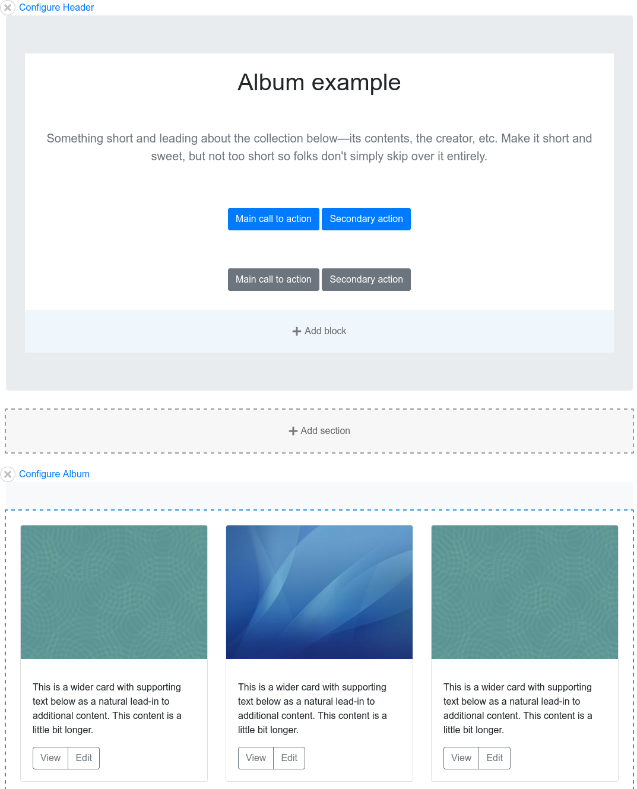

# UI Suite Bootstrap

A site-builder friendly [Bootstrap](https://getbootstrap.com/) theme for
Drupal 8 and 9, using the [UI Suite](https://www.drupal.org/project/ui_suite).

Use Bootstrap directly from Drupal backoffice (layout builder, manage display,
views, blocks, flags...).

Because we are targeting Bootstrap 4.x, this is not a fork of Nuvole's
[Bootstrap Patterns](https://github.com/nuvoleweb/bootstrap_patterns) theme.

# How it works

## Components chapter implemented with [UI Patterns](https://www.drupal.org/project/ui_patterns)

Each component is a folder in templates/pattern/.

You can browse the pattern libraries directly inside Drupal: /patterns; for
example, the 'card' pattern is available here: /patterns/card.

Thanks to the ui_patterns ecosystem, patterns are automatically available
directly for site building in many Drupal entities, as
[layout plugins](https://ui-patterns.readthedocs.io/en/8.x-1.x/content/layout-plugin.html),
[views row plugins](https://ui-patterns.readthedocs.io/en/8.x-1.x/content/views.html),
[field formatter plugins](https://www.drupal.org/project/ui_patterns_field_formatters/),
[views styles plugins](https://www.drupal.org/project/ui_patterns_views_style)...

## Utilities chapter implemented with [UI Styles](https://www.drupal.org/project/ui_styles)

Utilities are implemented as styles in ui_suite_bootstrap.ui_styles.yml

You can browse the styles libraries directly inside Drupal: /styles.

The styles are automatically available for site building inside layout builder's
components (blocks) & sections (layouts).

## Layouts chapter implemented with [Layout Options](https://www.drupal.org/project/layout_options)

A simple grid_row component is already set as a pattern for simple use cases.

For more complex use cases, layouts are implemented in ui_suite_bootstrap.layout.yml
and ui_suite_bootstrap.layout_options.yml

Those layouts are automatically available as configurable layout plugins.

## Examples section implemented with [UI Examples](hhttps://www.drupal.org/project/ui_examples)

4 example pages are integrated using only render arrays, inside
ui_suite_bootstrap.ui_examples.yml:

- [album](https://getbootstrap.com/docs/4.5/examples/album/)
- [pricing](https://getbootstrap.com/docs/4.5/examples/pricing/)
- [carousel](https://getbootstrap.com/docs/4.5/examples/carousel/)

You can browse the example pages directly inside Drupal: /examples

# Installation

If you install this theme from composer, it will install
[twbs/bootstrap](https://packagist.org/packages/twbs/bootstrap) too.

You need to do a symbolic link from
`/web/libraries/bootstrap`, or `/libraries/bootstrap`, to`/vendor/twbs/bootstrap/dist`.
