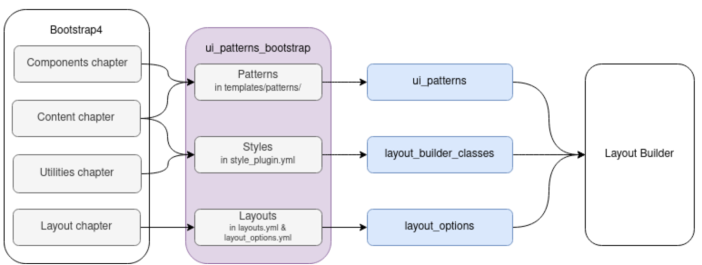

# UI Patterns Bootstrap

Integrates [Bootstrap](https://getbootstrap.com/) 4 with Drupal 8, using [UI Patterns](https://www.drupal.org/project/ui_patterns), [layout_options](https://www.drupal.org/project/layout_options) and [layout\_builder\_classes](https://github.com/pdureau/layout_builder_classes) modules:

Because we are targeting Bootstrap 4.x, this is not a fork of Nuvole's [Bootstrap Patterns](https://github.com/nuvoleweb/bootstrap_patterns) theme.

## Installation

If you install this theme from composer, it will install [twbs/bootstrap](https://packagist.org/packages/twbs/bootstrap) too.

You need to do a symbolic link from 
 `/web/libraries/bootstrap`, or  `/libraries/bootstrap`, to`/vendor/twbs/bootstrap/dist`.

